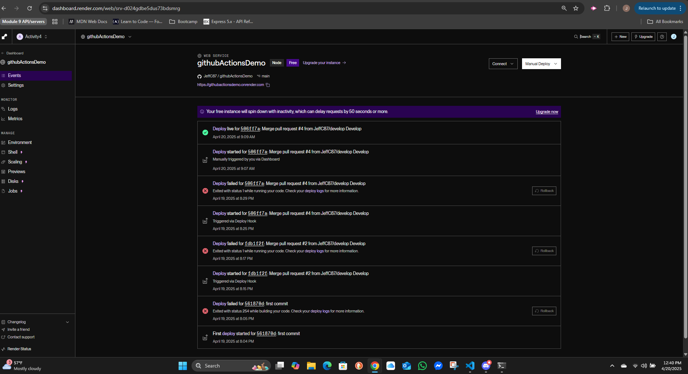
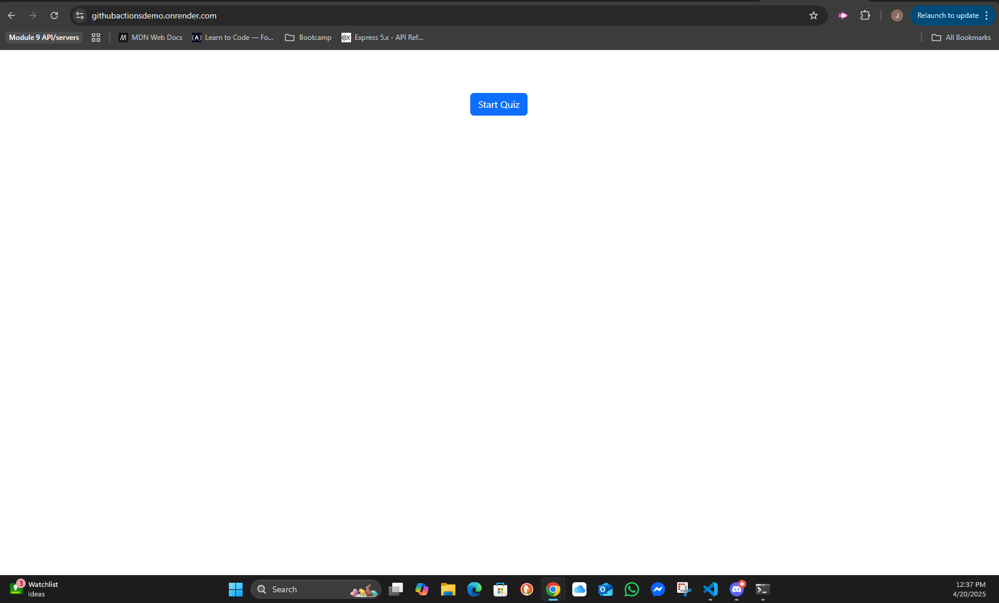
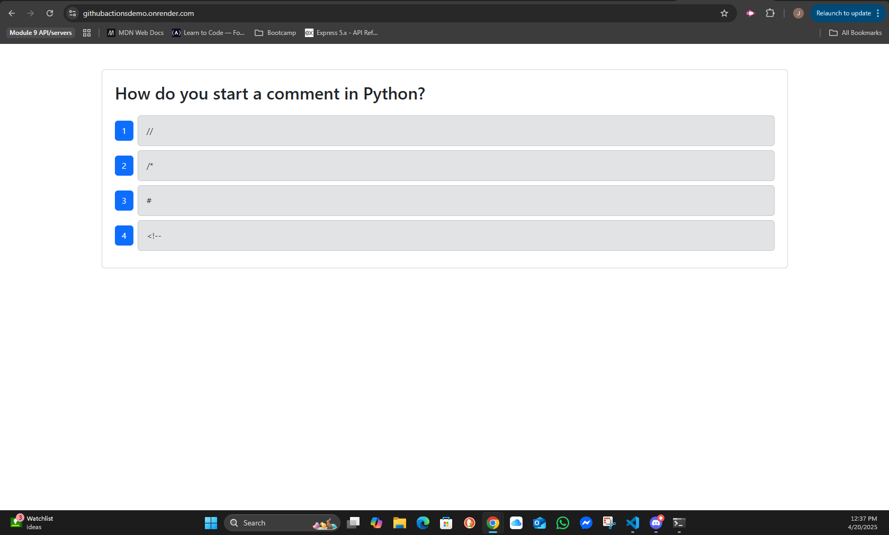

# Github Actions Demo

## Description

My motivation for this project was to learn and experience the continous deployment and test cycle with github actions and render.  Why did I build this project?  To expand my full stack skills and learn the technologies that are available to assist with web development.  The problems that it solves, is exposure to github actions and setting them up for the testing of the app.  I learned that some of the testing cycles can be tedious but serve a great benefit for the development cycle.

## Table of Contents

- [Installation](#installation)
- [Usage](#usage)
- [License](#license)
- [Links](#links)
- [Questions](#questions)

## Installation

Download repository, npm i, npm run build, npm run start

## Usage

The use of the actual project are self explanitory after opening the render link the actual project is a tech quiz game.

## License

This application is covered under the [The MIT License](https://opensource.org/licenses/MIT)

## Links

[GitHub Repository](https://github.com/JeffC87/githubActionsDemo)

[Deployed App](https://githubactionsdemo.onrender.com)

## Questions

if you have any questions feel free to use the links below.

[GitHub](https://github.com/JeffC87)

[jlc68@me.com](mailto:jlc68@me.com)

